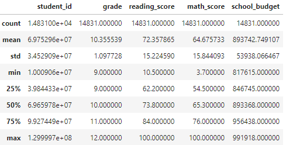
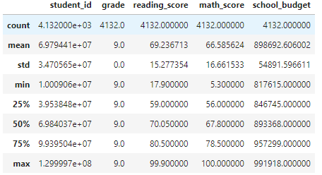
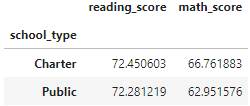

# Student_Data_Analysis

## Overview
Today we are helping the chief data scientist for a city school district, Maria. We must prepare standardized test results for analysis and reporting, then provide insights on performance trends and patterns. With these insights, we will be able to inform both individual schools and the city school district on performance. 

## Summary
When we were presented with the data set, we received it in the form of a <a href="Resources/new_full_student_data.csv">csv file</a>. After doing some quick checks, we found that there were 1968 reading scores and 982 math scores that were not filled in to the dataset. After dropping the rows with the blank data, we checked for duplicates. We were able to drop 1836 rows with duplicated data. To make our analysis easier, we had to convert the grade column to an integer by removing "th" from the values. 

After cleaning up our data, we were now ready to analyze. 

We started with a basic summary statistic of the entire dataset. using the .describe() function, we were able to get the statistics. 

  

From the summary statistics, we can see insights from the entire school district accross all grades. For instance, the average reading score is 72.35 while the average math score is 64.67. From this, we can deduce that the students are more likely to struggle in math than in reading. It may be beneficial to the students if the math curriculum was tweaked or if there was more assistance that the students can take advantage of. We can see that the 75th percentile is at 84 for reading and 76 for math, meaning that 25% of the students achieved a grade equal to or higher than that on their tests. This means that three quarters of the student body received less than a 76 for math, which is about a C. 

We were also able to drill down some more specific data regarding certain grade levels. Using the .loc[] function, we were able to take data specifically from freshmen. After this we also did more summary statistics. 

  

The average reading score for ninth graders was 69.25 while the average math score was 66.58. Comparitively to the whole student body, ninth graders performed quite worse in reading and slightly better in math. Narrowing down our sample size will allow us to more aptly strategize how to assist students of each grade level. For instance, the ninth graders may need less overall assistance for math, but more assistance for reading. 

Finally, we compared the performance of students in public versus private schools. To do this, we used the .groupby() function, focusing on school type. After this, we took the mean of that grouping's math and reading scores. 

  

Looking at this data, we see that there is minimal difference in reading scores between charter and public students. However, charter school students did seem to perform above public school students in math. With this information, we could look at what the charter schools are doing differently and attempt to replicate that in our public schools. 

